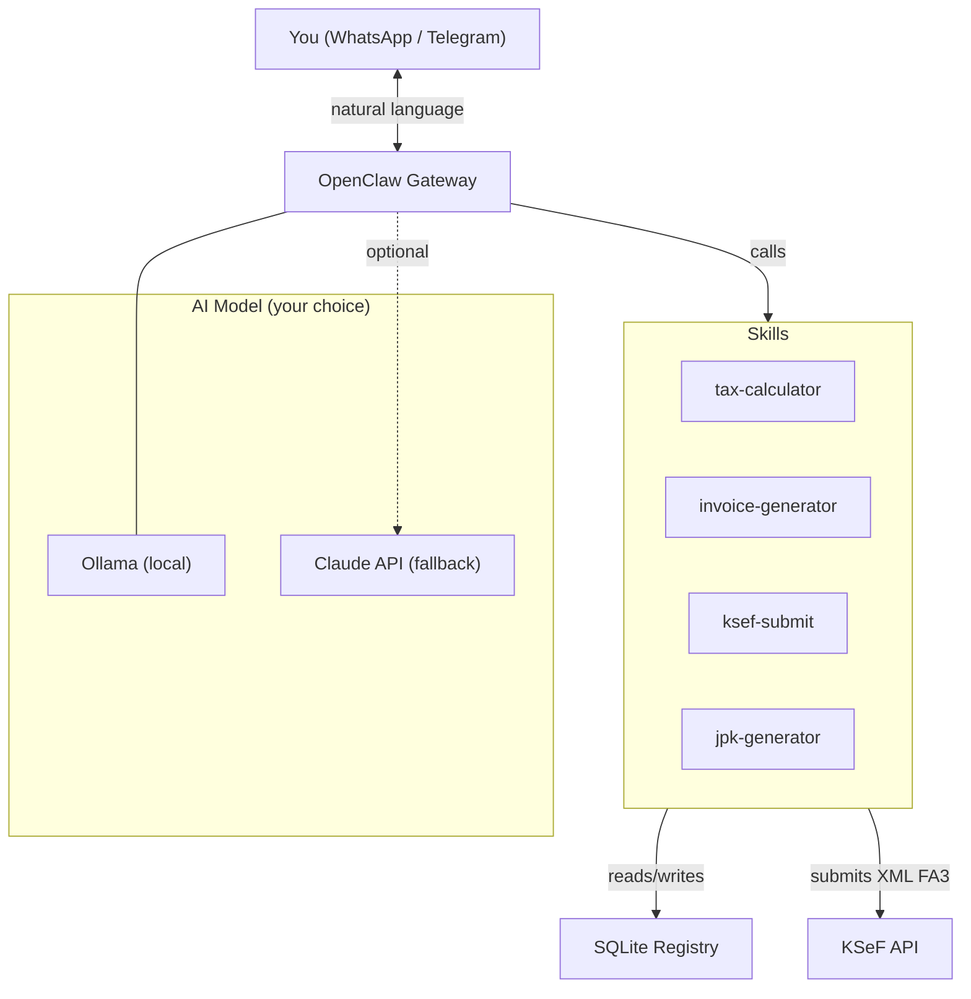

<p align="center">
  <h1 align="center">JDG Ksiegowy</h1>
  <p align="center">
    AI-powered accounting assistant for Polish sole proprietorships
    <br />
    Automates invoicing, KSeF, JPK, tax calculations, and reminders
    <br /><br />
    <a href="#quick-start">Quick Start</a> &bull;
    <a href="INSTALL.md">Installation Guide</a> &bull;
    <a href="#features">Features</a> &bull;
    <a href="#po-polsku">Po polsku</a>
  </p>
</p>

<p align="center">
  
  
  
  
  
</p>

---

## What is this?

**JDG Ksiegowy** is an open-source AI accounting assistant built for Polish sole proprietorships (JDG &mdash; *jednoosobowa dzialalnosc gospodarcza*).

It runs as an [OpenClaw](https://github.com/openclaw/openclaw) agent on your own server, communicates via **WhatsApp or Telegram**, and handles your entire monthly accounting cycle:

```
You: "Issue invoice for Acme Sp. z o.o., NIP 1234567890, 10500 PLN net, April 2026"

Agent: Invoice A1/04/2026 generated:
       - DOCX: data/faktury/2026/04/faktura_A1_04_2026.docx
       - KSeF: submitted, ref: KSeF-2026-04-00001234
       - Net: 10,500.00 PLN | VAT 23%: 2,415.00 PLN | Gross: 12,915.00 PLN
       
       Tax deadlines:
       - May 20: flat tax (ryczalt 12%) 1,260.00 PLN + ZUS 498.35 PLN
       - May 25: VAT (JPK_V7M) 2,415.00 PLN
```

No cloud dependencies. No subscriptions. Your data stays on your machine.

---

## Why not just use wFirma / inFakt / Comarch?

| Feature | wFirma / inFakt | JDG Ksiegowy |
|---------|----------------|--------------|
| Monthly cost | 50-150 PLN | **0 PLN** |
| KSeF submission | Yes | Yes (ksef2 SDK, 100% API coverage) |
| JPK_V7M generation | Yes | Yes (lxml, schema-validated) |
| AI assistant (tax Q&A) | No | **Yes** (natural language, any model) |
| Chat interface (WhatsApp/Telegram) | No | **Yes** (OpenClaw, 20+ channels) |
| Automated reminders | Email only | **WhatsApp/Telegram/Slack** |
| Auto-invoice from contracts | Limited | **Yes** (cron-scheduled) |
| Self-hosted / private | No (SaaS) | **Yes** (your server) |
| Model lock-in | N/A | **None** (Ollama, Claude, GPT, Gemini) |
| Open source | No | **MIT License** |

---

## Features

- **Invoice generation** &mdash; DOCX (for clients) + XML FA(3) (for KSeF) from a single command
- **KSeF integration** &mdash; automatic submission via [ksef2](https://github.com/artpods56/ksef2) SDK (all 73 API endpoints)
- **JPK_V7M** &mdash; monthly VAT declaration XML, schema-validated
- **Tax calculator** &mdash; VAT, flat tax (*ryczalt*), ZUS health contributions with 2026 rates
- **Proactive reminders** &mdash; cron-scheduled alerts before tax deadlines (17th, 20th, 22nd, 25th)
- **Payment tracking** &mdash; daily check for overdue invoices
- **Multi-channel** &mdash; WhatsApp, Telegram, Slack, Discord, and 20+ more via OpenClaw
- **Model-agnostic** &mdash; Ollama (local, free), Claude API, OpenAI, Gemini, or any provider
- **Deterministic tax math** &mdash; all calculations in Python with `Decimal`, never hallucinated

---

## Architecture



```
jdg-ksiegowy/
├── SOUL.md                  # Agent persona & Polish tax knowledge
├── HEARTBEAT.md             # Periodic checks (payments, deadlines)
├── CRON.md                  # Scheduled jobs setup guide
├── setup.sh                 # One-command installation
├── skills/                  # OpenClaw AgentSkills
│   ├── tax-calculator/      #   VAT, flat tax, ZUS calculations
│   ├── invoice/             #   DOCX + XML FA(3) generation
│   ├── ksef/                #   KSeF API submission
│   └── jpk/                 #   JPK_V7M monthly declaration
├── src/jdg_ksiegowy/        # Python library (deterministic core)
│   ├── config.py            #   Pydantic Settings from .env
│   ├── invoice/             #   Models, DOCX generator, XML generator
│   ├── ksef/                #   KSeF client (ksef2 SDK)
│   ├── tax/                 #   JPK_V7M, ZUS rates (single source of truth)
│   └── registry/            #   SQLite invoice/contract/payment registry
└── data/                    #   Database + generated files
```

---

## Quick Start

### Prerequisites

- Linux server (or WSL) with Docker
- Python 3.12+
- Node.js 18+ (for OpenClaw)

### One-command setup

```bash
git clone https://github.com/YOUR_USER/jdg-ksiegowy.git
cd jdg-ksiegowy
./setup.sh
```

The script installs Ollama + AI model, OpenClaw, Python dependencies, initializes the database, and walks you through connecting WhatsApp or Telegram.

### Manual setup

```bash
# 1. Install Ollama + AI model
curl -fsSL https://ollama.com/install.sh | sh
ollama pull qwen3.5:9b

# 2. Install OpenClaw
npm install -g openclaw@latest

# 3. Install Python dependencies
pip install -e .

# 4. Configure
cp .env.example .env
nano .env  # Fill in your business data

# 5. Initialize database
python3 -c "from jdg_ksiegowy.registry.db import init_db; init_db()"

# 6. Connect messaging channel
openclaw onboard  # Choose ollama → qwen3.5:9b → whatsapp/telegram

# 7. Register cron jobs (see CRON.md)
openclaw cron add "0 9 28 * *" "Generate monthly invoices and submit to KSeF"
# ... (see CRON.md for all 5 jobs)
```

See [INSTALL.md](INSTALL.md) for the full step-by-step guide.

---

## Configuration

All business data is configured via `.env` (never hardcoded):

| Variable | Required | Example |
|----------|----------|---------|
| `SELLER_NAME` | Yes | `Acme Jan Kowalski` |
| `SELLER_NIP` | Yes | `1234567890` |
| `SELLER_ADDRESS` | Yes | `ul. Przykladowa 1, 00-001 Warszawa` |
| `SELLER_BANK_ACCOUNT` | Yes | `00 0000 0000 0000 0000 0000 0000` |
| `SELLER_BANK_NAME` | Yes | `Bank Example` |
| `SELLER_EMAIL` | Yes | `kontakt@firma.pl` |
| `SELLER_TAX_FORM` | No | `ryczalt` (default) |
| `SELLER_RYCZALT_RATE` | No | `12` (default) |
| `SELLER_VAT_RATE` | No | `23` (default) |
| `SELLER_FIRST_NAME` | For JPK | `Jan` |
| `SELLER_LAST_NAME` | For JPK | `Kowalski` |
| `SELLER_BIRTH_DATE` | For JPK | `1990-01-01` |
| `SELLER_TAX_OFFICE_CODE` | For JPK | `1471` |
| `KSEF_ENV` | No | `test` (default) |
| `KSEF_TOKEN` | For KSeF | Token from ksef.mf.gov.pl |

---

## AI Model

JDG Ksiegowy is **model-agnostic**. Recommended setup:

| Role | Model | VRAM | Cost |
|------|-------|------|------|
| **Primary** (daily use) | `qwen3.5:9b` via Ollama | 6.6 GB | Free |
| **Fallback** (complex tax questions) | Claude API (pay-as-you-go) | Cloud | ~$0.50/mo |

Other tested models:

| Model | Polish | Vision (OCR) | JSON output | VRAM |
|-------|--------|-------------|-------------|------|
| `qwen3.5:9b` | Good | Yes | Excellent | 6.6 GB |
| `qwen3-vl:8b` | Good | Best | Excellent | 6.1 GB |
| `gemma4:26b` | Good | Yes | Native | 18 GB |
| `bielik:11b` | **Best** (dedicated) | No | Good | ~8 GB |
| `qwen3.5:4b` | OK | Yes | Good | 3.4 GB |

> **Note:** Anthropic blocked Claude Pro/Max subscriptions for OpenClaw on April 4, 2026. Use Claude API keys (pay-as-you-go) only, or stick with Ollama.

---

## Free Hosting

| Provider | RAM | Local AI? | Credit card | Cost |
|----------|-----|-----------|-------------|------|
| **Oracle Cloud** Always Free | 24 GB | Yes (Ollama) | Required (not charged) | **$0/forever** |
| Your existing VPS | Varies | If ≥8 GB | Already have | Already pay |
| Railway | 512 MB | No | Not required | $0-5/mo |

Oracle Cloud's Always Free tier (4 ARM CPUs, 24 GB RAM, 200 GB disk) is the recommended option for running Ollama + OpenClaw at zero cost.

---

## Tax Calendar (automated)

| Day | Event | Action |
|-----|-------|--------|
| **17th** | 3 days before flat tax deadline | Reminder with amounts |
| **20th** | Flat tax (*ryczalt*) + ZUS due | Urgent reminder |
| **22nd** | 3 days before VAT deadline | JPK_V7M generated + reminder |
| **25th** | VAT (JPK_V7M) due | Urgent reminder |
| **28th** | Invoice cycle | Auto-generate from contracts, submit to KSeF |
| **Daily** | Payment monitoring | Alert if overdue invoices |

---

## Testing Skills Manually

```bash
# Tax calculation
python3 skills/tax-calculator/scripts/calculate.py --netto 10500

# Invoice generation
python3 skills/invoice/scripts/generate.py \
  --buyer-name "Firma ABC" --buyer-nip "1234567890" --netto 10500

# JPK_V7M
python3 skills/jpk/scripts/generate_jpk.py --month 4 --year 2026

# KSeF submission (test environment)
python3 skills/ksef/scripts/submit.py --xml-path data/faktury/2026/04/faktura_A1_04_2026.xml
```

---

## Polish Tax Context

This tool is built specifically for Polish tax regulations as of 2026:

- **KSeF** (*Krajowy System e-Faktur*) &mdash; mandatory e-invoicing for all VAT payers since April 1, 2026
- **JPK_V7M** (*Jednolity Plik Kontrolny*) &mdash; monthly VAT declaration file sent to tax authorities
- **Ryczalt** (*ryczalt od przychodow ewidencjonowanych*) &mdash; flat-rate income tax (common for IT freelancers: 12%)
- **ZUS** &mdash; social insurance contributions (health insurance only for ryczalt taxpayers)

---

<a id="po-polsku"></a>

## Po polsku

**JDG Ksiegowy** to open-source'owy asystent ksiegowy AI dla jednoosobowej dzialalnosci gospodarczej.

Dziala jako agent [OpenClaw](https://github.com/openclaw/openclaw) na Twoim serwerze, komunikuje sie przez **WhatsApp lub Telegram**, i automatyzuje caly miesieczny cykl ksiegowy:

- Wystawianie faktur (DOCX + XML FA(3))
- Wysylka do KSeF (obowiazkowy od 1.04.2026)
- Generowanie JPK_V7M
- Obliczenia podatkowe (ryczalt, VAT, ZUS)
- Przypomnienia o terminach (20-ty: ryczalt+ZUS, 25-ty: VAT)
- Monitoring platnosci

### Szybki start

```bash
git clone https://github.com/YOUR_USER/jdg-ksiegowy.git
cd jdg-ksiegowy
./setup.sh
```

Szczegolowa instrukcja: [INSTALL.md](INSTALL.md)

---

## Contributing

Contributions are welcome! See [CONTRIBUTING.md](CONTRIBUTING.md) for guidelines.

Areas where help is needed:
- [ ] Support for *zasady ogolne* and *podatek liniowy* tax forms
- [ ] Invoice cost tracking (VAT input deduction)
- [ ] PIT-28 annual declaration generator
- [ ] Integration tests with KSeF test environment
- [ ] Web UI dashboard

---

## License

[MIT](LICENSE) &mdash; use it however you want.

---

<p align="center">
  Built for Polish freelancers who'd rather talk to an AI than click through accounting software.
</p>
