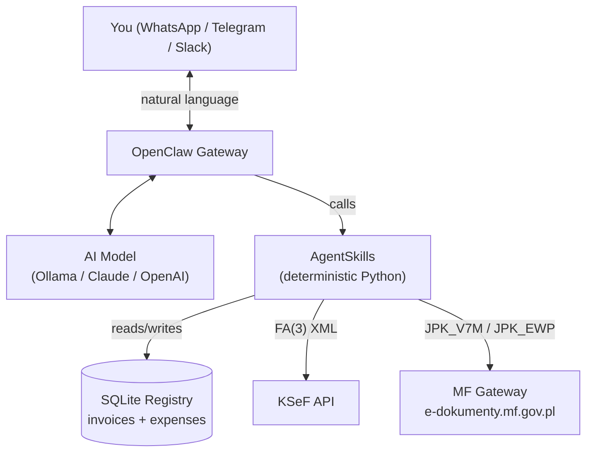

<p align="center">
  <h1 align="center">JDG Ksiegowy</h1>
  <p align="center">
    <strong>Open-source AI accounting assistant for Polish sole proprietorships (JDG)</strong>
    <br />
    Invoicing &bull; KSeF &bull; JPK_V7M &bull; JPK_EWP &bull; Ryczalt &bull; ZUS &bull; MF Gateway submit
    <br /><br />
    <a href="#quick-start">Quick Start</a> &bull;
    <a href="INSTALL.md">Installation</a> &bull;
    <a href="#features">Features</a> &bull;
    <a href="#status">Status</a> &bull;
    <a href="#po-polsku">Po polsku</a>
  </p>
</p>

<p align="center">
  
  
  
  
  
  
  
  
  
  
  
</p>

---

## Why this exists

If you run a JDG in Poland, your monthly cycle looks like this:

1. Issue invoices &rarr; send to client + upload to KSeF
2. Track costs &rarr; post them to your books
3. Calculate ryczalt + ZUS + VAT &rarr; remember three deadlines
4. Generate JPK_V7M &rarr; upload to MF e-Dokumenty
5. Once a year, generate JPK_EWP + PIT-28

Accounting SaaS (wFirma, inFakt, Fakturownia) charges 50&ndash;150 PLN/month to do this. They own your data. They lock you into their UI. And none of them let you just say &laquo;wystaw fakture Acme za kwiecien&raquo; from Telegram at 11 PM.

**JDG Ksiegowy replaces the core of that workflow** &mdash; self-hosted, AI-first, chat-native, on Ollama (free) or any LLM you like.

```
You: "Wystaw fakture Acme Sp. z o.o., NIP 1234567890, 10500 netto, kwiecien 2026"

Agent: Faktura A1/04/2026 wygenerowana:
       - DOCX: data/faktury/2026/04/faktura_A1_04_2026.docx
       - KSeF: wyslana, numer: KSeF-2026-04-00001234
       - Netto: 10 500,00 PLN | VAT 23%: 2 415,00 PLN | Brutto: 12 915,00 PLN

       Terminy podatkowe na maj:
       - 20 maja: ryczalt 12% = 1 260,00 PLN + ZUS 498,35 PLN
       - 25 maja: VAT (JPK_V7M) = 2 415,00 PLN
```

---

## Features

Honest state per feature &mdash; see [Status](#status) below for the full picture.

### Shipped and tested

**Invoicing & KSeF (obligatoryjny od 2026-02-01)**
- **Invoice generation** &mdash; DOCX (Polish, client-ready) + XML **FA(3)** via [ksef2](https://github.com/artpods56/ksef2) `FA3InvoiceBuilder`, namespace `crd.gov.pl/wzor/2025/06/25/13775/`
- **KSeF submission** &mdash; online session, send + wait + UPO retrieval, test/demo/prod env
- **Invoice corrections (FA KOR)** &mdash; price change, return, other reasons
- **Foreign invoices** &mdash; NP VAT code, EU buyers (KodUE + NrVatUE), non-EU (BrakID)
- **Recurring contracts** &mdash; auto-fakturowanie miesięczne for subscription clients
- **Email delivery** &mdash; PDF via LibreOffice-headless + SMTP, Polish body text

**Expenses & OCR**
- **Expense registry** &mdash; purchase invoices in SQLite with categories and `vat_deductible` flag
- **OCR faktur zakupu** &mdash; multimodal Pixtral 12B lokalnie (CPU inference) + Claude Haiku 4.5 fallback
- **Input VAT deduction in JPK_V7M** &mdash; expenses feed P_42 / P_43 automatically

**Payments**
- **Payment tracking** &mdash; overdue detection, manual mark-as-paid
- **Bank CSV import** &mdash; auto-match payments to invoices by NIP / title

**Declarations & submissions**
- **JPK_V7M generator** &mdash; schema v3, TNS `crd.gov.pl/wzor/2025/12/19/14090/` (CRWDE 2025-12-19, obowiązuje od 2026-02-01), K-field mapping per VAT rate
- **JPK_EWP generator** &mdash; roczna ewidencja przychodów ryczałtowca, TNS `jpk.mf.gov.pl/wzor/2024/10/30/10301/`
- **MF Gateway submission** &mdash; direct REST to e-dokumenty.mf.gov.pl with AES-256-CBC + RSA-OAEP, ZIP compression, status polling, UPO retrieval, autoryzacja danymi (no qualified signature required)
- **ZUS DRA** &mdash; monthly declaration in KEDU v5.05 format, health contribution by ryczalt income brackets
- **PIT-28** &mdash; annual ryczalt report with monthly income aggregation

**Utilities**
- **`jdg-status` dashboard** &mdash; upcoming deadlines (20th: ryczalt + ZUS, 25th: VAT + JPK), unpaid invoices, monthly summary
- **`tax-calculator`** &mdash; ryczalt, VAT, ZUS with 2026 rates and progressive health-contribution thresholds
- **`doctor` preflight** &mdash; verifies seller data, KSeF, MF Gateway, SMTP, OCR config before submission
- **NIP / PESEL validation** &mdash; mod-11 checksum, rejects malformed identifiers
- **`Decimal`-based math** &mdash; tax numbers never touch a float or an LLM

### Verified end-to-end

- **KSeF TEST sandbox** &mdash; FA(3) invoice accepted, KSeF number assigned, UPO retrieved (verified 2026-04-17)
- **MF Gateway TEST sandbox** &mdash; JPK submit with autoryzacja danymi, UPO retrieved
- **180 pytest tests** (unit + integration) passing

### Documented but not wired yet

- **Proactive cron reminders** &mdash; [CRON.md](CRON.md) lists the jobs; you register them manually with `openclaw cron add`. No daemon ships in this repo.
- **HEARTBEAT payment monitoring** &mdash; [HEARTBEAT.md](HEARTBEAT.md) describes the logic; overdue detection works on manual query, no push alerts yet

Contributions on any of the above are very welcome.

---

<a id="status"></a>

## Status

Verified against the actual codebase on 2026-04-17:

| Area | State | Evidence |
|------|:-----:|----------|
| Invoice DOCX + FA(3) XML (via ksef2 builder) | **Shipped + E2E** | [generator_xml.py](src/jdg_ksiegowy/invoice/generator_xml.py), [test_invoice_models.py](tests/test_invoice_models.py) |
| KSeF submission (online session + UPO) | **Shipped + E2E** | [ksef/client.py](src/jdg_ksiegowy/ksef/client.py), sandbox test 2026-04-17 |
| Invoice corrections (FA KOR) | **Shipped** | [test_invoice_correction.py](tests/test_invoice_correction.py) |
| Foreign invoices (NP, EU VAT, BrakID) | **Shipped** | [test_foreign_invoices.py](tests/test_foreign_invoices.py) |
| Recurring contracts (auto-invoicing) | **Shipped** | [skills/contracts/](skills/contracts/) |
| OCR purchase invoices (Pixtral + Claude) | **Shipped** | [expenses/ocr.py](src/jdg_ksiegowy/expenses/ocr.py) |
| Email delivery (LibreOffice PDF + SMTP) | **Shipped** | [invoice/mailer.py](src/jdg_ksiegowy/invoice/mailer.py), [invoice/pdf.py](src/jdg_ksiegowy/invoice/pdf.py) |
| Expense registry + VAT deduction in JPK | **Shipped** | [expenses/models.py](src/jdg_ksiegowy/expenses/models.py), [test_jpk_with_expenses.py](tests/test_jpk_with_expenses.py) |
| Payment tracking + bank CSV import | **Shipped** | [skills/contracts/scripts/import_bank.py](skills/contracts/scripts/import_bank.py) |
| JPK_V7M v3 (TNS 14090) | **Shipped** | [tax/jpk.py](src/jdg_ksiegowy/tax/jpk.py) |
| JPK_EWP v4 (TNS 10301) | **Shipped** | [tax/ewp.py](src/jdg_ksiegowy/tax/ewp.py) |
| MF Gateway submit (AES+RSA, UPO) | **Shipped + E2E** | [mf_gateway/crypto.py](src/jdg_ksiegowy/mf_gateway/crypto.py), [test_mf_crypto.py](tests/test_mf_crypto.py), sandbox |
| ZUS DRA (KEDU v5.05) | **Shipped** | [skills/zus-dra/](skills/zus-dra/) |
| PIT-28 annual report | **Shipped** | [skills/pit28/](skills/pit28/) |
| `jdg-status` dashboard | **Shipped** | [skills/jdg-status/](skills/jdg-status/) |
| Tax calculator (2026 rates) | **Shipped** | [tax/zus.py](src/jdg_ksiegowy/tax/zus.py) |
| `doctor` preflight | **Shipped** | [skills/doctor/](skills/doctor/) |
| NIP/PESEL validation | **Shipped** | [validators.py](src/jdg_ksiegowy/validators.py) |
| Cron / HEARTBEAT reminders | **Docs only** | Manual setup per [CRON.md](CRON.md) |
| Push alerts for overdue payments | **Missing** | Detection logic works; no notifier hooked up |

All claims above are grep-able in the repo. If you find a discrepancy, file an issue.

---

## Architecture



```
jdg-ksiegowy/
├── SOUL.md                     # Agent persona & Polish tax knowledge
├── HEARTBEAT.md                # Periodic checks (docs only, not wired yet)
├── CRON.md                     # Scheduled jobs setup guide
├── setup.sh                    # One-command installation
│
├── skills/                     # OpenClaw AgentSkills (Python entry points)
│   ├── tax-calculator/         #   VAT, ryczalt, ZUS, deadlines
│   ├── invoice/                #   DOCX + XML FA(3) generation
│   ├── invoice-send/           #   PDF + SMTP email delivery
│   ├── expense/                #   Register purchase invoices (manual + OCR)
│   ├── contracts/              #   Recurring contracts + bank CSV import
│   ├── ksef/                   #   Submit sales invoice to KSeF
│   ├── jpk/                    #   Generate JPK_V7M (monthly VAT)
│   ├── jpk-ewp/                #   Generate JPK_EWP (annual ryczalt)
│   ├── jpk-submit/             #   Submit JPK to MF Gateway, fetch UPO
│   ├── zus-dra/                #   ZUS DRA KEDU v5.05
│   ├── pit28/                  #   Annual ryczalt report
│   ├── jdg-status/             #   Upcoming deadlines + dashboard
│   └── doctor/                 #   Preflight config check
│
├── src/jdg_ksiegowy/           # Python library (core, reusable)
│   ├── config.py               #   Pydantic Settings from .env
│   ├── validators.py           #   NIP / PESEL mod-11 validation
│   ├── doctor.py               #   Config preflight
│   ├── invoice/                #   Models, DOCX, FA(3) via ksef2 builder, PDF, SMTP
│   ├── expenses/               #   Models, SQLite ops, OCR (Pixtral + Claude)
│   ├── contracts/              #   Recurring invoices, payment matching
│   ├── ksef/                   #   KSeF 2.0 client (ksef2 SDK wrapper)
│   ├── mf_gateway/             #   REST submit, AES-256-CBC + RSA-OAEP
│   ├── tax/                    #   JPK_V7M v3, JPK_EWP v4, ZUS, PIT-28
│   ├── zus/                    #   ZUS DRA KEDU builder
│   ├── status/                 #   Dashboard aggregations
│   └── registry/               #   SQLite registry (invoices, expenses)
│
├── tests/                      # Pytest — 180 unit + integration tests
└── data/                       # Database + generated files (git-ignored)
```

---

## Quick Start

### Prerequisites

- Linux, macOS, or Windows + WSL2
- Python 3.12+
- Docker (optional, for OpenClaw runtime)
- 8 GB RAM minimum if running Ollama locally; any machine works if you use a cloud LLM

### Install

```bash
git clone https://github.com/dithiothreitol/jdg-ksiegowy.git
cd jdg-ksiegowy
./setup.sh
```

The script installs Ollama, pulls a model, installs OpenClaw, installs Python deps, creates `.env` interactively, initializes SQLite, and walks you through connecting a messaging channel.

### Try it without OpenClaw / AI

You can use the Python skills as plain CLI tools &mdash; no AI runtime required:

```bash
pip install -e .
cp .env.example .env && nano .env

# Tax calc
python3 skills/tax-calculator/scripts/calculate.py --netto 10500

# Invoice generation (DOCX + FA(3) XML + registry row)
python3 skills/invoice/scripts/generate.py \
  --buyer-name "Acme Sp. z o.o." --buyer-nip "1234567890" --netto 10500

# Register a cost invoice
python3 skills/expense/scripts/add.py \
  --seller-name "Hetzner" --seller-nip "DE812871812" \
  --netto 50 --vat 11.50 --category infrastructure --vat-deductible true

# JPK_V7M for April 2026 (pulls invoices + deductible expenses from SQLite)
python3 skills/jpk/scripts/generate_jpk.py --month 4 --year 2026

# Submit the generated JPK to MF Gateway (dry-run available)
python3 skills/jpk-submit/scripts/submit.py --file data/jpk/2026_04.xml --dry-run

# OCR a purchase invoice (Pixtral lokalnie lub Claude Haiku fallback)
python3 skills/expense/scripts/add.py --file faktura_hetzner.pdf --ocr

# Submit the generated invoice XML to KSeF sandbox
python3 skills/ksef/scripts/submit.py --xml-path data/faktury/2026/04/faktura_A1_04_2026.xml

# Current-state dashboard (upcoming deadlines + unpaid invoices)
python3 skills/jdg-status/scripts/status.py

# Preflight config check before going to prod
python3 skills/doctor/scripts/check.py
```

Full guide: [INSTALL.md](INSTALL.md)

---

## Configuration

All business data is in `.env` (never hardcoded). See [`.env.example`](.env.example) for the full list. Minimum required:

| Variable | Required | Example |
|----------|----------|---------|
| `SELLER_NAME` | Yes | `Acme Jan Kowalski` |
| `SELLER_NIP` | Yes | `1234567890` |
| `SELLER_ADDRESS` | Yes | `ul. Przykladowa 1, 00-001 Warszawa` |
| `SELLER_BANK_ACCOUNT` | Yes | `00 0000 0000 0000 0000 0000 0000` |
| `SELLER_EMAIL` | Yes | `kontakt@firma.pl` |
| `SELLER_TAX_FORM` | No | `ryczalt` (default) |
| `SELLER_RYCZALT_RATE` | No | `12` (default, percent) |
| `SELLER_VAT_RATE` | No | `23` (default, percent) |
| `SELLER_FIRST_NAME` / `LAST_NAME` / `BIRTH_DATE` | For JPK | &mdash; |
| `SELLER_TAX_OFFICE_CODE` | For JPK | `1471` |
| `KSEF_ENV` | No | `test` (default) &rarr; switch to `prod` when ready |
| `KSEF_TOKEN` | For KSeF | Generate at ksef.mf.gov.pl |
| `MF_*` | For JPK submit | *dane autoryzujace* &mdash; see [INSTALL.md](INSTALL.md) |

---

## AI Model

JDG Ksiegowy is **model-agnostic**. The AI handles natural-language intent and document understanding; all tax math is deterministic Python on `Decimal`.

Two-tier architecture:

| Role | Model | Usage |
|------|-------|-------|
| **Primary** (daily chat, intent &rarr; skill dispatch, JSON output) | [`qwen3.5:9b`](https://ollama.com/library/qwen3.5) via Ollama | Local, ~0 PLN |
| **Vision** (OCR faktur zakupu from PDF / JPG / PNG) | [`pixtral:12b`](https://ollama.com/library/pixtral) via Ollama | Local, CPU inference OK |
| **OCR fallback** (when Pixtral output is malformed) | Claude Haiku 4.5 API | ~2 PLN / month typical |
| **Optional chat fallback** (tricky tax Q&A) | Claude API (pay-as-you-go) | Opt-in via `ANTHROPIC_API_KEY` |

Key property: the LLM identifies intent (e.g. "register a Hetzner invoice for 50 EUR as infrastructure cost") and extracts fields from scanned documents, but it never computes VAT, ryczalt, or ZUS &mdash; those go through `Decimal`-based skills with `pydantic` validation.

Polish-native models ([Bielik](https://bielik.ai)) are not currently in the Ollama registry under that name &mdash; you can import GGUF manually if you want best-in-class Polish fluency.

> **Note:** Anthropic blocked Claude Pro/Max subscriptions for OpenClaw agents on 2026-04-04. Use Claude API keys (pay-as-you-go) or stick with Ollama.

---

## Free hosting options

| Provider | RAM | Local AI? | Monthly cost |
|----------|-----|-----------|--------------|
| **Oracle Cloud** Always Free | 24 GB | Yes (Ollama) | 0 PLN forever |
| Your existing VPS | depends | If &ge; 8 GB | already paying |
| Small VPS + Claude API | any | No (cloud LLM) | ~20 PLN + API |
| Railway / Fly.io free tier | 512 MB | No | 0 PLN |

Oracle Cloud Always Free (4 ARM OCPU, 24 GB RAM, 200 GB disk) is enough for OpenClaw + Ollama for a single user.

---

## KSeF timeline (what the law actually says)

From the Polish Ministry of Finance, as of 2026-04-17:

| Date | Obligation |
|------|------------|
| **2026-02-01** | Mandatory KSeF for large taxpayers (2024 sales &gt; 200 M PLN gross) |
| **2026-04-01** | Mandatory KSeF for everyone else (most JDG users are here) |
| **2027-01-01** | Mandatory KSeF for micro-taxpayers (&le; 10 k PLN/month sales) |

From 2026-02-01 onwards, **receiving** KSeF invoices is mandatory for everyone, even before you need to issue them there.

Sources: [ksef.podatki.gov.pl](https://ksef.podatki.gov.pl/informacje-ogolne-ksef-20/podstawy-prawne-oraz-kluczowe-terminy/), [gov.pl](https://www.gov.pl/web/ias-bialystok/obowiazkowy-ksef-przesuniety-na-1-lutego-2026-r).

---

## Polish tax context

Built for 2026 regulations:

- **KSeF** &mdash; *Krajowy System e-Faktur*, mandatory per timeline above
- **JPK_V7M** &mdash; monthly VAT declaration, schema v2 (supported); schema v3 update is on the roadmap
- **JPK_EWP** &mdash; annual *ewidencja przychodow* for ryczalt, v4 schema (XSD pending final MF release)
- **Ryczalt** &mdash; flat-rate income tax (12% for most IT services)
- **ZUS** &mdash; health contribution only for ryczalt, progressive by annual income bracket
- **Dane autoryzujace** &mdash; personal + prior-year income data used to authenticate JPK submissions without a qualified signature

---

<a id="po-polsku"></a>

## Po polsku

**JDG Ksiegowy** to open-source'owy asystent ksiegowy AI dla jednoosobowej dzialalnosci gospodarczej w Polsce. Zastepuje rdzen pracy, ktora dzis robisz w wFirmie / inFakcie / Fakturowni, za **0 PLN/miesiac** &mdash; na Twoim serwerze, z rozmowa po polsku przez WhatsApp, Telegram lub Slack.

### Co dziala dzis (zweryfikowane w kodzie, 180 testow passing)

**Fakturowanie i KSeF**
- Wystawia faktury **FA(3)** (DOCX + XML przez ksef2 `FA3InvoiceBuilder`) i wysyla do **KSeF 2.0** z odbiorem UPO &mdash; e2e zweryfikowane na sandboxie MF
- Faktury **korygujace (FA KOR)** i **zagraniczne** (NP, EU VAT, BrakID)
- **Cykliczne kontrakty** &mdash; auto-fakturowanie miesieczne dla stalych klientow
- Wysylka faktury mailem jako **PDF** (LibreOffice + SMTP)

**Koszty i OCR**
- **OCR faktur zakupu** &mdash; lokalny Pixtral 12B + fallback Claude Haiku 4.5 (rzucasz PDF, dostajesz wpis do rejestru)
- Rejestruje faktury kosztowe i odlicza **VAT naliczony** w JPK_V7M (P_42 / P_43)

**Platnosci**
- Sledzenie niezaplaconych / przeterminowanych faktur
- Import wyciagow CSV z banku &mdash; automatyczne oznaczanie zaplaconych po NIP / tytule

**Deklaracje**
- **JPK_V7M v3** (TNS 14090, obowiazuje od 2026-02-01)
- **JPK_EWP v4** (roczna ewidencja przychodow ryczaltowca)
- Wysylka JPK do **bramki MF** (REST + AES + RSA, autoryzacja danymi, UPO)
- **ZUS DRA** (KEDU v5.05) &mdash; skladki zdrowotne wg progow rycztaltu
- **PIT-28** &mdash; roczny raport rycztaltowca

**Narzedzia**
- Dashboard `jdg-status` &mdash; nadchodzace terminy (20-ty: rycztaltl + ZUS; 25-ty: VAT + JPK)
- Kalkulator podatkow (VAT / rycztaltl / ZUS, stawki 2026)
- `doctor` &mdash; preflight sprawdzajacy konfiguracje przed wysylka do KSeF / MF
- Walidacja NIP / PESEL (mod-11)

### Czego jeszcze nie ma

- Automatycznego daemona od przypomnien (tylko instrukcja w [CRON.md](CRON.md))
- Push alertow dla przeterminowanych platnosci (wykrywanie dziala na zapytanie, brak notyfikacji)

### Szybki start

```bash
git clone https://github.com/dithiothreitol/jdg-ksiegowy.git
cd jdg-ksiegowy
./setup.sh
```

Pelna instrukcja: [INSTALL.md](INSTALL.md)

### Dlaczego warto

- **0 PLN/miesiac** zamiast 50&ndash;150 PLN za SaaS
- **Dane zostaja u Ciebie** &mdash; SQLite na Twoim serwerze, zero chmury
- **Rozmowa po polsku** &mdash; nie klikasz przez formularze
- **MIT License** &mdash; mozesz modyfikowac, forkowac, uzywac komercyjnie
- **Deterministyczna matematyka** &mdash; LLM nigdy nie liczy podatkow

---

## Roadmap

- [ ] Cron/heartbeat daemon (currently only documented)
- [ ] Push alerts for overdue payments (Slack/Telegram/email)
- [ ] *Zasady ogolne* and *podatek liniowy* tax forms (currently ryczalt-only)
- [ ] MPP (split payment) indicator on invoices
- [ ] GTU codes for sensitive categories (fuel, electronics, pharmaceuticals)
- [ ] VAT-UE / VAT-OSS for intra-EU B2C sales
- [ ] Fixed assets register + depreciation
- [ ] Web UI dashboard (read-only)
- [ ] Multi-user mode (accountants managing several JDGs)
- [ ] CI integration tests against KSeF test environment

---

## Contributing

PRs, bug reports, and tax-regulation corrections are very welcome. See [CONTRIBUTING.md](CONTRIBUTING.md).

If you are a Polish tax advisor or accountant and spot something wrong, please open an issue &mdash; accuracy matters more than speed here.

---

## Security

JDG Ksiegowy handles sensitive data: NIPs, bank accounts, income figures, KSeF tokens, MF Gateway authorization data.

- Secrets stay in `.env` (git-ignored)
- Data lives in local SQLite (no network sync)
- MF Gateway payloads are encrypted per MF spec: **AES-256-CBC** (PKCS#7 padding) for content, **RSA-OAEP** for the session key
- No telemetry, no analytics, no third-party calls beyond KSeF / MF Gateway / your chosen LLM

If you find a security issue, open a private advisory on GitHub or email the maintainer instead of filing a public issue.

---

## License

[MIT](LICENSE) &mdash; use it, fork it, ship it, sell services on top of it. Attribution appreciated but not required.

---

## Acknowledgements

- [OpenClaw](https://github.com/openclaw/openclaw) &mdash; the agent runtime
- [ksef2](https://github.com/artpods56/ksef2) &mdash; Python SDK for KSeF v2.0 API
- [CIRFMF/ksef-docs](https://github.com/CIRFMF/ksef-docs) &mdash; official MF KSeF documentation
- [Ollama](https://ollama.com) &mdash; local LLM runtime

---

<p align="center">
  <strong>If this saves you an hour a month, star the repo.</strong><br/>
  <sub>Built for Polish freelancers who'd rather talk to an AI than click through accounting software.</sub>
</p>
